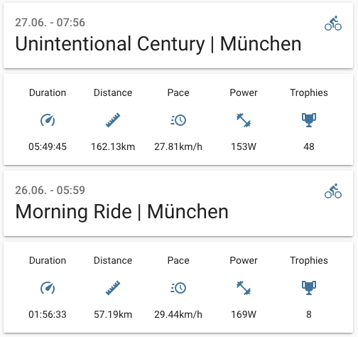

# Strava Home Assistant Integration
Custom Component to integrate Activity Data from Strava into Home Assistant.


## Features
* Gives you access to statistics for **up to 10 of your most recent activities** in Strava.
* Pulls Year-to-Date (YTD) and All-Time **summary statistics for Run, Ride, and Swimm activities**
* Exposes **5 customizeable sensor entities** for each Strava activity + 18 additional entities for summary statistics
* Creates a **camera entity** in Home Assistant to **feature recent Strava pictures** as a photo-carousel
* Supports both the **metric and the imperial** unit system
* Activity data in Home Assistant **auto-updates** whenever you add, modify, or delete activities on Strava
* **Easy set-up**: only enter your Strava Client-ID and -secret and you're ready to go



### Activity Stats (for up to 10 Strava Activities)
For every Strava activity, the Strava Home Assistant Integration creates a **device entity** in Home Assistant (max 10 activities). Each of these virtual device entities exposes **five sensor entities** which you can customize to display one of the following **activity KPIs**:
* Duration (Minutes),
* Pace (Minutes/Mile ; Minutes/Km)
* Speed (Miles/Hour; Km/Hour)
* Distance (Miles; Km)
* \# Kudos
* Kalories (cKal),
* Elevation Gain (Feet, Meter)
* Power (Watts)
* \# Trophies

**One additional sensor entity** will be available for every Strava activity to display Date & Title of the underlying activity. To map a name to an activities's GPS start location, Strava Home Assistant relies on the free API at [geocode.xyz](https://geocode.xyz). In the event that Strava Home Assistant cannot fetch a location name from geocode.xyz, it'll put "Paradise City" as the default location.

Since every Strava activity gets its own virtual device, you can use the underlying sensor data in your **Dashboards and Automations**, just as you'd use any other sensor data in Home Assistant. To learn how to display information about your most recent Strava Activities, please reference the **UI-configuration example** below.

### Summary Statistics (for up to 10 Strava Activities)
The Strava Home Assistant Integration creates a **device entity** for both **Year-to-Date and All-Time** summary statistics. Each of these virtual device entities exposes **nine sensor entities**:
* Moving Time
* Distance
* Activity Count
...for **Ride, Run, and Swim** activities

### Photo Carousel (for up to 100 Strava Photos)
The Strava Home Assistant Integration creates a single **camera entity** to display a photo carousel based on **pictures from your Strava activities**. Up to 100 unique image URLs are buffered locally. **New image URLs** are automatically added whenever a new activity is being uploaded to Strava. New **photos of already existing activites** are added once every night.


## Installation
### First, set up remote access to your Home Assistant Installation
To use the Strava Home Assitant integration, your Home Assistant Instance must be accessible from an **External URL** (i.e. Remote Access). Without remote access, the integration won't be able to pull data from Strava. To learn how to set up Remote Access for Home Assistant, please visit the [Official Documentation](https://www.home-assistant.io/docs/configuration/remote/)


### Second, obtain your Strava API credentials
After you've set up remote access and configured the External URL for your Home Assistant instance, head over to your **Strava Profile**. Under "**Settings**", go to "**My API Application**", follow the steps in the configuration wizard, and eventually obtain your Strava API credentials (ID + secret). We need those credentials during the final installation step.

**!!! IMPORTANT !!!** It is essential that the **Authorization Callback Domain** which you set for your Strava API matches the domain of your **Home Assistant External URL**

### Third, add the Strava Home Assistant Integration to your Home Assistant Insallation
As of now, the Strava Home Assistant Integration can only be installed as a custom repository through the Home Assistant Community Store (HACS). The installation process is super easy, check out my **5-minute tutorial on how to install Custom Components in HACS** [here](https://medium.com/@codingcyclist/how-to-install-any-custom-component-from-github-in-less-than-5-minutes-ad84e6dc56ff)

### Fourth, make a connection between your Strava account and Home Assistant
Now is the time to fire up the Strava Home Assitant Integration for the first time and make a connection between Strava and your Home Assistant Instance. 


From within Home Assistant, head over to `Configuration` > `Integrations` and hit the "+"-symbol at the bottom. Search for "Strava Home Assistant" and click on the icon to add the Integration to Home Assistant. You'll automatically be prompted to enter your Strava API credentials. Here, you can also **chose to not import Photos from Strava**. If you chose to untick `Import Photos from Strava?`, the photo carousel will not be available . It'll take a few seconds to complete the set-up process after you've granted all the required permissions.

## Configuration/Customization
_Strava Home Assistant only supports configuration through the Home Assitant UI. Configuration via. `configuration.yaml` will be deprecated [official announcement to the HA community](https://www.home-assistant.io/blog/2020/04/14/the-future-of-yaml/) and is therefore not supported._

Upon completion of the installation process, the Strava Home Assistant integration **automatically creates device- and sensor entities** for you to access data from your most recent Strava activities. The number of sensor entities varies, depending on how many of your most recent Strava activities you whish to track from within Home Assistant (5 + 1 sensors per activity). Per default, only sensor entities for the **two most recent Strava activities** are visible in Home Assistant. Please read the section below to learn how to change the number of visible sensor entities for Strava Home Assistant.

### Increase/Decrease the number of Strava activities avaiable in Home Assistant
You can always **adjust the number of Strava activities you whish to track** from within Home Assistant (min 1; max 10). 


Just locate the Strava Home Assistant Integration under `Configuration` > `Integrations`, click on `Options`, and use the slider to adjust the number of activities. After you've saved your settings, it might take a few minutes for Home Assistant to create the corresponding sensor entities and fetch the underlying data. The activities available in Home Assistant always correspond to the most recent ones under your Strava profile.

### Increase/Decrease the frequency of the Photo Carousel
Once you locate the Strava Home Assistant Integration configuration under `Configuration` > `Integrations` > `Options`, you can determine **how many seconds it takes** before the camera state changes to the next Image. Intervals < 15 seconds are not recommended since the Home Assistant UI will then struggle to re-render to UI at the same rate.

### Configure sensor entities for different types of Strava Activities
Strava Home Assistant exposes **five sensor entities for every Strava activity**. You customize the Strava-KPI for each of those five sensors as follows:

1. Go to `Configuration` > `Integrations`
2. Locate the Strava Home Assistant Integration and click on `Options`
3. Leave the number of concurrent Strava Activities as is and hit `SUBMIT` to proceed
4. Chose an activity type and configure the KPI-Sensor matching as you see fit
5. Hit `SUBMIT` for your changes to take effect

You can only change the sensor configuration for **one activity type at a time**. After you've completed the configuration for a given activity type, you can **start over** to change the sensor configuration for another activity type.

As of now, customization is only supported for **Ride, Run, and Hike activities**.

### Integrate Strava Activities into your Home Assistant UI
Below, you can find an example UI-configuration, which adds metrics from your two most recent Strava activities to a separate Lovelace Dashboard in Home Assitant.


```yaml
title: Home
views:
  - title: Strava
    icon: 'mdi:strava'
    path: strava
    theme: ''
    badges: []
    cards:
      - cards:
          - entity: sensor.strava_0_0
            type: entity
          - entities:
              - entity: sensor.strava_0_1
              - entity: sensor.strava_0_2
              - entity: sensor.strava_0_3
              - entity: sensor.strava_0_4
              - entity: sensor.strava_0_5
            type: glance
        type: vertical-stack
      - cards:
          - entity: sensor.strava_1_0
            type: entity
          - entities:
              - entity: sensor.strava_1_1
              - entity: sensor.strava_1_2
              - entity: sensor.strava_1_3
              - entity: sensor.strava_1_4
              - entity: sensor.strava_1_5
            type: glance
        type: vertical-stack
```

## Contributors
- [@codingcyclist](https://github.com/codingcyclist)

## TODO
- [] Add customization support for more activity types
- [] Add German language support
- [] Add support for more KPIs